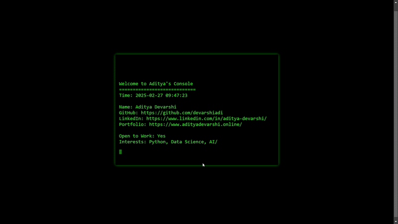

**"Technology has no limits, only possibilities."**

# How to Run a Flask App in Google Colab

Flask is a lightweight web framework in Python that allows you to build web applications quickly. While it is typically run on local machines or servers, you can also run Flask applications in Google Colab using a few tricks. This guide will take you through the step-by-step process of running a Flask app inside Google Colab and making it accessible over the internet.



## **Step 1: Install Flask in Google Colab**

Google Colab does not come with Flask pre-installed. Install it by running the following command:

```python
!pip install flask
```

## **Step 2: Create a Flask App**

Create a simple Flask application inside a code cell:

```python
%%writefile app.py

from flask import Flask, render_template_string
from datetime import datetime

app = Flask(__name__)

HTML_TEMPLATE = """
<!DOCTYPE html>
<html lang="en">
<head>
    <meta charset="UTF-8">
    <meta name="viewport" content="width=device-width, initial-scale=1.0">
    <title>Aditya's Console</title>
    <link rel="icon" href="https://www.adityadevarshi.online/favicon.ico" type="image/x-icon">
    <style>
        body { background-color: black; color: limegreen; font-family: monospace; padding: 20px; display: flex; justify-content: center; align-items: center; height: 100vh; margin: 0; }
        .console { max-width: 90%; width: 600px; white-space: pre-wrap; font-size: 1.2rem; overflow: hidden; padding: 15px; box-shadow: 0px 0px 10px rgba(0,255,0,0.5); border-radius: 5px; background: rgba(0, 0, 0, 0.9); }
        .cursor { display: inline-block; width: 10px; height: 18px; background: limegreen; animation: blink 0.7s infinite; }
        a { color: limegreen; text-decoration: none; word-break: break-word; }
        a:hover { text-decoration: underline; }
        @keyframes blink { 50% { opacity: 0; } }
        @media (max-width: 768px) {
            .console { font-size: 1rem; padding: 10px; max-width: 95%; }
            .cursor { width: 8px; height: 16px; }
        }
    </style>
</head>
<body>
    <div class="console">
        <pre id="typing-text"></pre><span class="cursor"></span>
    </div>
    <script>
        const text = `
Welcome to Aditya's Console
============================
Time: {current_time}

Name: Aditya Devarshi
GitHub: https://github.com/devarshiadi
LinkedIn: https://www.linkedin.com/in/aditya-devarshi/
Portfolio: https://www.adityadevarshi.online/

Open to Work: Yes
Interests: Python, Data Science, AI/ML
============================

Thanks for reading my article! More at
 https://medium.com/@devarshia5
`;
        let index = 0;
        function typeEffect() {
            if (index < text.length) {
                let preElement = document.getElementById("typing-text");
                preElement.textContent += text.charAt(index);
                index++;
                setTimeout(typeEffect, 50);
            } else {
                let preElement = document.getElementById("typing-text");
                preElement.innerHTML = preElement.textContent.replace(/(https?:\/\/\S+)/g, '<a href="$1" target="_blank">$1</a>');
            }
        }
        typeEffect();
    </script>
</body>
</html>
""".replace("{current_time}", datetime.now().strftime("%Y-%m-%d %H:%M:%S"))

@app.route('/')
def home():
    return render_template_string(HTML_TEMPLATE)

if __name__ == '__main__':
    app.run(debug=True)

```

## **Step 3: Run Flask in the Background**

Since running Flask directly in Google Colab’s notebook will block the execution, use threading to run it in the background:

```python
import threading
import subprocess

def run_flask():
    subprocess.run(["python", "app.py"])

flask_thread = threading.Thread(target=run_flask)
flask_thread.daemon = True
flask_thread.start()
```

## **Step 4: Expose Flask to the Internet**

Google Colab runs in an isolated environment, so we need a way to expose our local Flask server to the internet. Use `serveo.net` to create an SSH tunnel:

```bash
!ssh -o StrictHostKeyChecking=no -R 80:localhost:5000 serveo.net
```

Once this command is executed, it will generate a public URL that you can use to access your Flask app from any device.

## **Step 5: Access Your Flask App**

Copy the public URL from Serveo and open it in your browser. You should see the "Hello, Flask on Colab!" message.

---

### **Bonus: Running an Advanced Flask App with HTML**

If you want to build a more interactive UI, you can use Flask with HTML templates, just like we did with the **console-style typing animation** in our previous example. You can add Bootstrap for styling and JavaScript animations to enhance user experience.

```python
from flask import Flask, render_template_string

app = Flask(__name__)

HTML_PAGE = """
<!DOCTYPE html>
<html>
<head>
    <title>Flask in Colab</title>
</head>
<body>
    <h1>Welcome to Flask in Google Colab!</h1>
</body>
</html>
"""

@app.route('/')
def home():
    return render_template_string(HTML_PAGE)

if __name__ == '__main__':
    app.run()
```

Now, you can host and access this app just like before.

---

## **Conclusion**

Running Flask in Google Colab is a useful trick for quick prototyping and sharing projects. Using Serveo, you can expose your Flask app to the internet and test it in real-world scenarios.

🚀 I've also shared a ready-to-use **Google Colab notebook** for you to try: [Flask on Colab Notebook](https://github.com/devarshiadi/FlaskColabExample/blob/main/FlaskColabExample.ipynb)

🔗 Connect with me on LinkedIn: [Aditya Devarshi](https://www.linkedin.com/in/aditya-devarshi/)
🔗 Read more on Medium: [My Medium Profile](https://medium.com/@devarshia5)

🙏 Special thanks to Serveo for making easy tunneling possible!

**"The best investment a company can make is in hiring the right talent."**

💼 If you're a recruiter, I’m **open to work!** Interested in **Python, Data Science, AI/ML** and eager to contribute to exciting projects.

Stay tuned—there’s always more to explore! 🚀

